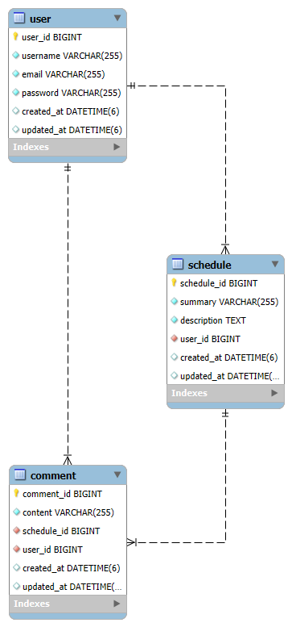
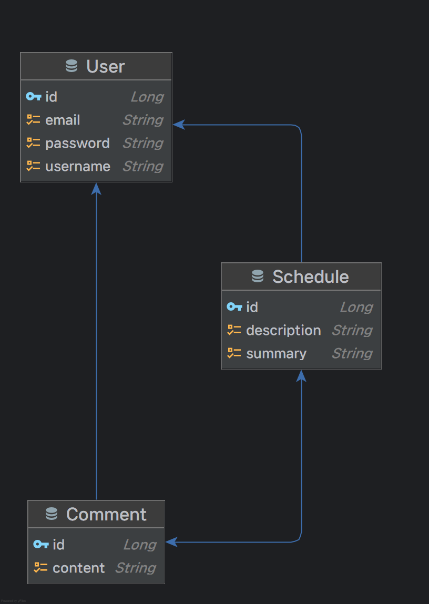

# Advanced Scheduler API

# **1. 프로젝트 개요**

- 일정과 일정에 대한 댓글을 작성, 수정, 삭제, 조회할 수 있는 API 서버입니다.
- Cookie/Session을 이용한 인증, 인가를 지원합니다.
- Spring Boot와 Spring Web MVC 그리고 Spring Data JPA를 이용하여 개발했습니다.
- 개발 일정
    - 최초: 2025년 8월 5일 오전 10:00 → 2025년 8월 14일 오후 2:00
- 개발 인원: 1인

# **2. 주요 기능 및 주안점**

## **2.1 주요 기능**

- **일정 관련 기능**
    - 일정 생성: 제목, 내용, 작성자 정보를 포함하여 생성
    - 특정 일정 조회: 일정에 대한 **작성자, 모든 댓글 함께 조회**
    - 전체 일정 조회: 일정에 작성된 댓글의 개수와 작성자 정보 함께 표시, **페이징** 지원
    - 일정 수정: 일정을 작성한 유저인지 검증 후 수정
    - 일정 삭제: 일정을 작성한 유저인지 검증 후 삭제, **일정 삭제 시 작성된 댓글도 모두 함께 삭제**
- **유저 관련 기능**
    - 유저 생성: 유저명, 이메일, 비밀번호 등을 포함하여 생성 → 회원가입
    - 유저 조회: 특정 유저 정보 조회
    - 유저 목록 조회: 전체 유저 목록 조회
    - 유저 수정: 로그인한 유저의 정보가 맞는지 session 확인 후 수정
    - 유저 삭제: 로그인한 유저의 정보가 맞는지 session 확인 후 삭제, **자동 로그아웃 및 Session 만료**
- **댓글 관리**
    - 댓글 생성: 일정에 작성자 정보를 포함하여 댓글 생성
    - 댓글 목록 조회: 특정 일정에 작성된 모든 댓글 조회
    - 특정 댓글 조회: 댓글 정보 조회
    - 댓글 수정: 댓글을 작성한 유저인지 검증 후 수정
    - 댓글 삭제: 댓글을 작성한 유저인지 검증 후 삭제
- **인증/인가**
    - 로그인: 생성한 유저 정보를 바탕으로 이메일, 비밀번호 검증 후 로그인, Cookie/Session 활용
    - 로그아웃: 연결된 Session 만료를 통해 로그아웃
    - 비밀번호 암호화: BCrypt 활용
    - **회원가입, 로그인을 제외한 모든 API는 로그인 필수**
- **유효성 검증**
    - 요청 데이터의 제약 조건(길이, 필수값 등) 검증
    - 입력 값 누락, 비밀번호 불일치 등 예외 상황에 대한 처리

## **2.2 주안점**

- JPA와 Spring Data JPA의 기본 기능을 이해하고 객체 중심의 데이터 설계 및 기능 구현을 하기 위해 노력했습니다.
- Cookie, Session을 이해하고 로그인 상태 관리를 적용하기 위해 노력했습니다.
- OOP의 개념을 이해하고, OOP로 이루어진 Spring 프레임워크를 이해하면서 개발하기 위해 노력했습니다.
- 3 Layer Architecture(Controller, Service, Repository) 를 이해하고 적용하기 위해 노력했습니다.
- HTTP를 이해하고 올바른 RESTful API 및 클라이언트 개발자와의 협업을 고려하면서 API를 설계했습니다.
- 모던 Java의 문법을 의식적으로 익히고 적절하게 사용하기 위해 노력했습니다.

# **3. 개발 환경**

- **언어**: JavaSE 17
- **프레임워크**: Spring Boot 3.2.x
- **데이터베이스**: MySQL 8.x
- **ORM**: Spring Data JPA
- **빌드 도구**: Gradle
- **기타**: Lombok, Postman, [BCrypt Password Hashing Function
  ](https://mvnrepository.com/artifact/at.favre.lib/bcrypt)

# **4. 프로젝트 구조 및 실행 방법**

## **4.1 프로젝트 구조**

- `domain`, `global` 루트 안 2개의 패키지 존재
    - `domain`
        - `comment`
        - `schedule`
        - `user`
    - `global`
        - `annotation`
        - `code`
        - `config`
        - `dto`
        - `entity`
        - `exception`
        - `security`

```
advanced-scheduler-api/
├── src/
│   ├── main/
│   │   ├── java/
│   │   │   ├── io/
│   │   │       ├── github/
│   │   │           ├── seonrizee/
│   │   │               ├── scheduler/
│   │   │                   ├── domain/
│   │   │                   │   ├── comment/
│   │   │                   │   │   ├── controller/
│   │   │                   │   │   │   └── CommentController.java
│   │   │                   │   │   ├── dto/
│   │   │                   │   │   │   ├── request/
│   │   │                   │   │   │   │   ├── CommentCreateRequest.java
│   │   │                   │   │   │   │   └── CommentUpdateRequest.java
│   │   │                   │   │   │   ├── response/
│   │   │                   │   │   │       └── CommentDetailResponse.java
│   │   │                   │   │   ├── entity/
│   │   │                   │   │   │   └── Comment.java
│   │   │                   │   │   ├── mapper/
│   │   │                   │   │   │   └── CommentMapper.java
│   │   │                   │   │   ├── repository/
│   │   │                   │   │   │   └── CommentRepository.java
│   │   │                   │   │   ├── service/
│   │   │                   │   │       ├── CommentQueryService.java
│   │   │                   │   │       ├── CommentService.java
│   │   │                   │   │       └── CommentServiceImpl.java
│   │   │                   │   ├── schedule/
│   │   │                   │   │   ├── controller/
│   │   │                   │   │   │   └── ScheduleController.java
│   │   │                   │   │   ├── dto/
│   │   │                   │   │   │   ├── request/
│   │   │                   │   │   │   │   ├── ScheduleCreateRequest.java
│   │   │                   │   │   │   │   └── ScheduleUpdateRequest.java
│   │   │                   │   │   │   ├── response/
│   │   │                   │   │   │       ├── ScheduleDetailResponse.java
│   │   │                   │   │   │       └── SchedulePageResponse.java
│   │   │                   │   │   ├── entity/
│   │   │                   │   │   │   └── Schedule.java
│   │   │                   │   │   ├── mapper/
│   │   │                   │   │   │   └── ScheduleMapper.java
│   │   │                   │   │   ├── repository/
│   │   │                   │   │   │   └── ScheduleRepository.java
│   │   │                   │   │   ├── service/
│   │   │                   │   │       ├── ScheduleQueryService.java
│   │   │                   │   │       ├── ScheduleService.java
│   │   │                   │   │       └── ScheduleServiceImpl.java
│   │   │                   │   ├── user/
│   │   │                   │       ├── controller/
│   │   │                   │       │   ├── SessionController.java
│   │   │                   │       │   └── UserController.java
│   │   │                   │       ├── dto/
│   │   │                   │       │   ├── request/
│   │   │                   │       │   │   ├── SessionCreateRequest.java
│   │   │                   │       │   │   ├── UserRegisterRequest.java
│   │   │                   │       │   │   └── UserUpdateRequest.java
│   │   │                   │       │   ├── response/
│   │   │                   │       │       ├── UserListResponse.java
│   │   │                   │       │       └── UserProfileResponse.java
│   │   │                   │       ├── entity/
│   │   │                   │       │   └── User.java
│   │   │                   │       ├── mapper/
│   │   │                   │       │   └── UserMapper.java
│   │   │                   │       ├── repository/
│   │   │                   │       │   └── UserRepository.java
│   │   │                   │       ├── service/
│   │   │                   │           ├── UserQueryService.java
│   │   │                   │           ├── UserService.java
│   │   │                   │           └── UserServiceImpl.java
│   │   │                   ├── global/
│   │   │                   │   ├── annotation/
│   │   │                   │   │   └── LoginUser.java
│   │   │                   │   ├── code/
│   │   │                   │   │   ├── ErrorCode.java
│   │   │                   │   │   └── SuccessCode.java
│   │   │                   │   ├── config/
│   │   │                   │   │   ├── web/
│   │   │                   │   │   │   ├── LoginUserIdArgumentResolver.java
│   │   │                   │   │   │   └── WebConfig.java
│   │   │                   │   │   └── JpaAuditingConfig.java
│   │   │                   │   ├── dto/
│   │   │                   │   │   └── ApiResponse.java
│   │   │                   │   ├── entity/
│   │   │                   │   │   └── BaseDateTimeEntity.java
│   │   │                   │   ├── exception/
│   │   │                   │   │   ├── CustomBusinessException.java
│   │   │                   │   │   └── GlobalExceptionHandler.java
│   │   │                   │   ├── security/
│   │   │                   │       ├── config/
│   │   │                   │       │   └── PasswordEncoderConfig.java
│   │   │                   │       ├── filter/
│   │   │                   │       │   └── SessionFilter.java
│   │   │                   │       ├── service/
│   │   │                   │       │   └── AuthService.java
│   │   │                   │       └── SessionManager.java
│   │   │                   └── AdvancedSchedulerApiApplication.java
│   │   ├── resources/
│   │       ├── static/
│   │       ├── templates/
│   │       ├── application-dev.yml
│   │       ├── application-prod.yml
│   │       └── application.yml
│   ├── test/
│       ├── java/
│           ├── io/
│               ├── github/
│                   ├── seonrizee/
│                       ├── scheduler/
│                           └── AdvancedSchedulerApiApplicationTests.java
├── README.md
├── build.gradle
├── gradlew
├── gradlew.bat
└── settings.gradle

```

## **4.2 실행 방법**

1. `build.gradle` 을 이용하여 의존성 동기화
2. `.env.example` 파일을 열어서 양식 확인 후 환경변수 내용 작성
3. 원하는 방식으로 환경변수 주입
    - 로컬 환경에서는 간단히 Intellij 실행 환경 구성-옵션 수정-환경 변수 파일 등록 방법을 사용
4. `application.yml`의 `active`확인 후 `AdvancedSchedulerApiApplication.java`파일의`main`메소드를 실행
5. 애플리케이션이 실행되면 Postman 등의 API 클라이언트 도구를 사용하여 테스트

# **5. 주요 설계**

## **5.1 ERD (Entity Relationship Diagram)**





- **Schedule → User**: `Schedule` 객체는 하나의 `User` 객체를 참조합니다.
    - 하나의 일정은 한 명의 사용자에 의해 작성됩니다.
    - 단방향 @ManyToOne 사용
- **Comment → User**: `Comment` 객체는 하나의 `User` 객체를 참조합니다.
    - 하나의 댓글은 한 명의 사용자에 의해 작성됩니다.
    - 단방향 @ManyToOne 사용
- **Comment ←→ Schedule**: `Comment` 객체는 하나의 `Schedule` 객체를 참조합니다.
    - 하나의 일정은 여러 댓글을 가질 수 있고, 각 댓글은 어느 일정에 속해 있는지 알 수 있습니다.
    - 양방향 @ManyToOne 사용

## **5.2 도메인별 제약 조건**

### **5.2.1 User 도메인**

- **입력값 제약 조건 (DTO)**
    - **회원가입 (`UserRegisterRequest`)**
        - `username`: 필수 입력, 4~15자의 영문 대소문자와 숫자로만 구성
        - `email`: 필수 입력, 유효한 이메일 형식
        - `password`: 필수 입력, 8~16자 사이의 영문, 숫자, 특수문자를 모두 포함
    - **프로필 수정 (`UserUpdateRequest`)**
        - `username`: 필수 입력, 4~15자의 영문 대소문자와 숫자로만 구성
        - `email`: 필수 입력, 유효한 이메일 형식
    - **로그인 (`SessionCreateRequest`)**
        - `email`: 필수 입력, 유효한 이메일 형식
        - `password`: 필수 입력
- **데이터베이스 제약 조건 (Entity)**
    - **User**
        - `id`: Primary Key, Auto-increment
        - `username`: Not Null, Unique
        - `email`: Not Null, Unique
        - `password`: Not Null
        - `createdAt`, `updatedAt`: 자동 생성 및 갱신

### **5.2.2 Schedule 도메인**

- **입력값 제약 조건 (DTO)**
    - **일정 생성/수정 (`ScheduleCreateRequest`, `ScheduleUpdateRequest`)**
        - `summary` (제목): 필수 입력, 최대 50자
        - `description` (설명): 필수 입력
- **데이터베이스 제약 조건 (Entity)**
    - **Schedule**
        - `id`: Primary Key, Auto-increment
        - `summary`: Not Null
        - `description`: Not Null, TEXT 타입 (긴 내용 저장 가능)
        - `user_id`: Foreign Key (User), Not Null
        - `createdAt`, `updatedAt`: 자동 생성 및 갱신

### **5.2.3 Comment 도메인**

- **입력값 제약 조건 (DTO)**
    - **댓글 생성/수정 (`CommentCreateRequest`, `CommentUpdateRequest`)**
        - `content`: 필수 입력, 최대 255자
- **데이터베이스 제약 조건 (Entity)**
    - **Comment**
        - `id`: Primary Key, Auto-increment
        - `content`: Not Null
        - `user_id`: Foreign Key (User), Not Null
        - `schedule_id`: Foreign Key (Schedule), Not Null
        - `createdAt`, `updatedAt`: 자동 생성 및 갱신

## **5.3 RESTful API 설계**

### **5.3.1. API 요약**

**일정 (Schedules)**

| 기능           | HTTP Method | URL               | 설명                     |
|--------------|-------------|-------------------|------------------------|
| **일정 생성**    | `POST`      | `/schedules`      | 새로운 일정을 등록합니다.         |
| **전체 일정 조회** | `GET`       | `/schedules`      | 모든 일정을 페이지네이션으로 조회합니다. |
| **선택 일정 조회** | `GET`       | `/schedules/{id}` | 특정 ID의 일정을 조회합니다.      |
| **일정 수정**    | `PATCH`     | `/schedules/{id}` | 특정 ID의 일정 정보를 수정합니다.   |
| **일정 삭제**    | `DELETE`    | `/schedules/{id}` | 특정 ID의 일정을 삭제합니다.      |

**댓글 (Comments)**

| 기능           | HTTP Method | URL                        | 설명                    |
|--------------|-------------|----------------------------|-----------------------|
| **댓글 생성**    | `POST`      | `/schedules/{id}/comments` | 특정 일정에 새로운 댓글을 작성합니다. |
| **댓글 목록 조회** | `GET`       | `/schedules/{id}/comments` | 특정 일정의 모든 댓글을 조회합니다.  |
| **댓글 단건 조회** | `GET`       | `/comments/{id}`           | 특정 ID의 댓글을 조회합니다.     |
| **댓글 수정**    | `PATCH`     | `/comments/{id}`           | 특정 ID의 댓글을 수정합니다.     |
| **댓글 삭제**    | `DELETE`    | `/comments/{id}`           | 특정 ID의 댓글을 삭제합니다.     |

**사용자 & 인증 (Users & Authentication)**

| 기능            | HTTP Method | URL           | 설명                     |
|---------------|-------------|---------------|------------------------|
| **사용자 등록**    | `POST`      | `/users`      | 새로운 사용자를 생성합니다. (회원가입) |
| **전체 사용자 조회** | `GET`       | `/users`      | 모든 사용자 목록을 조회합니다.      |
| **선택 사용자 조회** | `GET`       | `/users/{id}` | 특정 ID의 사용자 정보를 조회합니다.  |
| **사용자 수정**    | `PATCH`     | `/users/{id}` | 특정 ID의 사용자 정보를 수정합니다.  |
| **사용자 삭제**    | `DELETE`    | `/users/{id}` | 특정 ID의 사용자를 삭제합니다.     |
| **로그인**       | `POST`      | `/sessions`   | 사용자 인증 후 세션을 생성합니다.    |
| **로그아웃**      | `DELETE`    | `/sessions`   | 현재 세션을 만료시켜 로그아웃합니다.   |

---

### **5.3.2 API 상세 명세**

- **API별 기능 설명은 2.1 주요 기능, 5.2 제약 조건, 5.4 API 응답 코드도 함께 참조하세요.**
- **유저 등록과 로그아웃을 제외하면 모두 Headers Cookie에 Session 정보 필요**
- Headers

  | **Key** | **Value** |
                            | --- | --- |
  | Cookie | JSESSIONID=641622029B46698DC998950F12AFAE78 |

**일정 생성**

- **Method**:`POST`
- **URL**:`/schedules`
- **Description**: 새로운 일정을 등록합니다.

**Request Body**

```
{
	"summary": "일정 제목1",
	"description": "일정 내용1"
}
```

**Response (201 Created)**

```
{
    "code": "SC-201",
    "message": "리소스가 성공적으로 생성되었습니다.",
    "data": {
        "id": 1,
        "summary": "제목1",
        "description": "내용1",
        "userId": 1,
        "username": "asdf12345",
        "createdAt": "2025-08-14T03:55:20.5164309",
        "updatedAt": "2025-08-14T03:55:20.5164309",
        "comments": []
    }
}
```

---

**일정 목록 조회**

- **Method**:`GET`
- **URL**:`/schedules?page=1&size=10`
- **Description**:
    - 모든 일정을 조회합니다.
    - page와 size를 통해 페이징을 제공합니다.
    - 일정에 작성된 댓글을 함께 제공합니다.

**Query Parameters**

- `page`: 조회할 page
- `size`: 한 페이지마다 가져올 일정의 size, default:10

**Response (200 OK)**

```
{
    "code": "SC-200",
    "message": "요청이 성공적으로 처리되었습니다.",
    "data": {
        "content": [
            {
                "id": 1,
                "description": "일정 내용1",
                "updatedAt": "2025-08-14T09:57:30.630077",
                "username": "asdf1234",
                "createdAt": "2025-08-14T09:57:30.630077",
                "summary": "일정 제목1",
                "userId": 1,
                "commentCount": 1
            }, ...
        ],
        "page": {
            "size": 10,
            "number": 0,
            "totalElements": 1,
            "totalPages": 1
        }
    }
}
```

---

**일정 단건 조회**

- **Method**:`GET`
- **URL**:`/schedules/{id}`
- **Description**:
    - 특정 ID의 일정을 조회합니다.
    - 댓글이 존재하는 경우 전체 댓글을 포함하여 응답합니다.

**Path Parameters**

- `id`: 조회할 일정의 ID

**Response (200 OK) - 댓글이 존재하지 않는 경우**

```
{
    "code": "SC-200",
    "message": "요청이 성공적으로 처리되었습니다.",
    "data": {
        "id": 2,
        "summary": "일정 제목1",
        "description": "일정 내용1",
        "userId": 1,
        "username": "asdf1234",
        "createdAt": "2025-08-14T10:02:28.323261",
        "updatedAt": "2025-08-14T10:02:28.323261",
        "comments": []
    }
}
```

**Response (200 OK) - 댓글이 존재하는 경우**

```
{
    "code": "SC-200",
    "message": "요청이 성공적으로 처리되었습니다.",
    "data": {
        "id": 1,
        "summary": "일정 제목1",
        "description": "일정 내용1",
        "userId": 1,
        "username": "asdf1234",
        "createdAt": "2025-08-14T09:57:30.630077",
        "updatedAt": "2025-08-14T09:57:30.630077",
        "comments": [
            {
                "id": 1,
                "content": "댓글 내용1",
                "userId": 1,
                "username": "asdf1234",
                "createdAt": "2025-08-14T09:57:37.80549",
                "updatedAt": "2025-08-14T09:57:37.80549"
            }
        ]
    }
}
```

---

**일정 수정**

- **Method**:`PATCH`
- **URL**:`/schedules/{id}`
- **Description**:
    - 특정 ID의 일정 정보를 수정합니다.
    - 제목과 내용을 수정할 수 있습니다.

**Path Parameters**

- `id`: 수정할 일정의 ID

**Request Body**

```
{
	"summary": "수정 일정 제목1",
	"description": "수정 일정 내용1"
}
```

**Response (200 OK)**

```
{
    "code": "SC-200",
    "message": "요청이 성공적으로 처리되었습니다.",
    "data": {
        "id": 1,
        "summary": "수정 일정 제목1",
        "description": "수정 일정 내용1",
        "userId": 1,
        "username": "asdf1234",
        "createdAt": "2025-08-14T09:57:30.630077",
        "updatedAt": "2025-08-14T09:57:30.630077",
        "comments": [
            {
                "id": 1,
                "content": "댓글 내용1",
                "userId": 1,
                "username": "asdf1234",
                "createdAt": "2025-08-14T09:57:37.80549",
                "updatedAt": "2025-08-14T09:57:37.80549"
            }
        ]
    }
}
```

---

**일정 삭제**

- **Method**:`DELETE`
- **URL**:`/schedules/{id}`
- **Description**:
    - 특정 ID의 일정을 삭제합니다.
    - 일정에 작성된 댓글도 함께 삭제됩니다.

**Path Parameters**

- `id`: 삭제할 일정의 ID

**Response (200 OK)**

- 클라이언트에서 일관성 있는 처리를 할 수 있도록 기본 응답 포맷을 전송하기에 `200 OK`로 사용

```
{
    "code": "SC-200",
    "message": "요청이 성공적으로 처리되었습니다.",
    "data": null
}
```

---

**댓글 생성**

- **Method**:`POST`
- **URL**:`/schedules/{id}/comments`
- **Description**: 특정 일정에 새로운 댓글을 작성합니다.

**Path Parameters**

- `id`: 댓글을 작성할 일정의 ID

**Request Body**

```
{
	"content": "댓글 내용1"
}
```

**Response (201 Created)**

```
{
    "code": "SC-201",
    "message": "리소스가 성공적으로 생성되었습니다.",
    "data": {
        "id": 2,
        "content": "댓글 내용1",
        "userId": 1,
        "username": "asdf1234",
        "createdAt": "2025-08-14T10:05:25.3973071",
        "updatedAt": "2025-08-14T10:05:25.3973071"
    }
}
```

**댓글 목록 조회**

- **Method**:`GET`
- **URL**:`/schedules/{id}/comments`
- **Description**: 특정 일정의 모든 댓글을 조회합니다.

**Path Parameters**

- `id`: 댓글을 조회할 일정의 ID

**Response (200 OK)**

```
{
    "code": "SC-200",
    "message": "요청이 성공적으로 처리되었습니다.",
    "data": [
        {
            "id": 1,
            "content": "댓글 내용1",
            "userId": 1,
            "username": "asdf1234",
            "createdAt": "2025-08-14T09:57:37.80549",
            "updatedAt": "2025-08-14T09:57:37.80549"
        },
        {
            "id": 2,
            "content": "댓글 내용1",
            "userId": 1,
            "username": "asdf1234",
            "createdAt": "2025-08-14T10:05:25.397307",
            "updatedAt": "2025-08-14T10:05:25.397307"
        }
    ]
}
```

**댓글 단건 조회**

- **Method**:`GET`
- **URL**:`/comments/{id}`
- **Description**:
    - 특정 ID의 댓글을 조회합니다.

**Path Parameters**

- `id`: 조회할 댓글의 ID

**Response (200 OK)**

```
{
    "code": "SC-200",
    "message": "요청이 성공적으로 처리되었습니다.",
    "data": {
        "id": 1,
        "content": "댓글 내용1",
        "userId": 1,
        "username": "asdf1234",
        "createdAt": "2025-08-14T09:57:37.80549",
        "updatedAt": "2025-08-14T09:57:37.80549"
    }
}
```

**댓글 수정**

- **Method**:`PATCH`
- **URL**:`/comments/{id}`
- **Description**: 특정 ID의 댓글을 수정합니다.

**Path Parameters**

- `id`: 수정할 댓글의 ID

**Request Body**

```
{
	"content": "수정 댓글 내용1"
}
```

**Response (200 OK)**

```
{
    "code": "SC-200",
    "message": "요청이 성공적으로 처리되었습니다.",
    "data": {
        "id": 1,
        "content": "수정12",
        "userId": 1,
        "username": "asdf1234",
        "createdAt": "2025-08-13T15:41:19.846475",
        "updatedAt": "2025-08-13T15:41:19.846475"
    }
}
```

**댓글 삭제**

- **Method**:`DELETE`
- **URL**:`/comments/{id}`
- **Description**:특정 ID의 댓글을 삭제합니다.

**Path Parameters**

- `id`: 삭제할 댓글의 ID

**Response (200 OK)**

- 클라이언트에서 일관성 있는 처리를 할 수 있도록 기본 응답 포맷을 전송하기에 `200 OK`로 사용

```
{
    "code": "SC-200",
    "message": "요청이 성공적으로 처리되었습니다.",
    "data": null
}
```

**유저 등록**

- **Method**:`POST`
- **URL**:`/users`
- **Description**: 새로운 유저를 생성합니다.

**Path Parameters**

- `id`: 댓글을 작성할 일정의 ID

**Request Body**

```
{
	"username": "asdf1234",
	"email": "asdf1234@naver.com",
   "password": "asdf1234!"
}
```

**Response (201 Created)**

```
{
    "code": "SC-201",
    "message": "리소스가 성공적으로 생성되었습니다.",
    "data": {
        "id": 1,
        "username": "asdf1234",
        "email": "asdf1234@naver.com",
        "createdAt": "2025-08-14T09:57:03.2489576",
        "updatedAt": "2025-08-14T09:57:03.2489576"
    }
}
```

**유저 목록 조회**

- **Method**:`GET`
- **URL**:`/users`
- **Description**: 유저 목록을 조회합니다.

**Response (200 OK)**

```
{
    "code": "SC-200",
    "message": "요청이 성공적으로 처리되었습니다.",
    "data": [
        {
            "id": 1,
            "username": "asdf1234",
            "email": "asdf1234@naver.com",
            "createdAt": "2025-08-14T10:20:27.222839",
            "updatedAt": "2025-08-14T10:20:27.222839"
        },
        {
            "id": 2,
            "username": "asdf12345",
            "email": "asdf12345@naver.com",
            "createdAt": "2025-08-14T10:20:58.476761",
            "updatedAt": "2025-08-14T10:20:58.476761"
        }
    ]
}
```

**유저 단건 조회**

- **Method**:`GET`
- **URL**:`/users/{id}`
- **Description**: 특정 ID의 유저 정보를 조회합니다.

**Path Parameters**

- `id`: 조회할 유저의 ID

**Response (200 OK)**

```
{
    "code": "SC-200",
    "message": "요청이 성공적으로 처리되었습니다.",
    "data": {
        "id": 1,
        "username": "asdf1234",
        "email": "asdf1234@naver.com",
        "createdAt": "2025-08-14T09:57:03.248958",
        "updatedAt": "2025-08-14T09:57:03.248958"
    }
}
```

**유저 수정**

- **Method**:`PATCH`
- **URL**:`/users/{id}`
- **Description**: 특정 ID의 유저 정보를 수정합니다.

**Path Parameters**

- `id`: 수정할 유저의 ID

**Request Body**

```
{
    "username": "asdf123456",
    "email": "asdf123456@naver.com"
}
```

**Response (200 OK)**

```
{
    "code": "SC-200",
    "message": "요청이 성공적으로 처리되었습니다.",
    "data": {
        "id": 1,
        "username": "asdf123456",
        "email": "asdf123456@naver.com",
        "createdAt": "2025-08-14T10:20:27.222839",
        "updatedAt": "2025-08-14T10:20:27.222839"
    }
}
```

**유저 삭제**

- **Method**:`DELETE`
- **URL**:`/users/{id}`
- **Description**:특정 ID의 유저를 삭제합니다.

**Path Parameters**

- `id`: 삭제할 유저의 ID

**Response (200 OK)**

- 클라이언트에서 일관성 있는 처리를 할 수 있도록 기본 응답 포맷을 전송하기에 `200 OK`로 사용

```
{
    "code": "SC-200",
    "message": "요청이 성공적으로 처리되었습니다.",
    "data": null
}
```

**로그인**

- **Method**:`POST`
- **URL**:`/sessions`
- **Description**:
    - 유저 정보를 입력하여 로그인합니다.
    - 유저 정보를 검증하고 Session을 생성합니다.
    - 로그인 된 유저의 정보를 반환합니다.

**Request Body**

```
{
	"email": "asdf12345@naver.com",
  "password": "asdf12345!"
}
```

**Response (200 OK)**

```
{
    "code": "SC-200",
    "message": "요청이 성공적으로 처리되었습니다.",
    "data": {
        "id": 3,
        "username": "asdf12345",
        "email": "asdf12345@naver.com",
        "createdAt": "2025-08-14T10:24:54.089891",
        "updatedAt": "2025-08-14T10:24:54.089891"
    }
}
```

**로그아웃**

- **Method**:`DELETE`
- **URL**:`/sessions`
- **Description**:
    - 로그아웃합니다.
    - 유저 정보를 검증하고 Session을 만료시킵니다.

**Response (200 OK)**

- 클라이언트에서 일관성 있는 처리를 할 수 있도록 기본 응답 포맷을 전송하기에 `200 OK`로 사용

```
{
    "code": "SC-200",
    "message": "요청이 성공적으로 처리되었습니다.",
    "data": null
}
```

## 5.4 API 응답 코드

### **5.4.1. 성공 코드 (SuccessCode)**

| 코드       | 메시지                 | 설명                                        |
|----------|---------------------|-------------------------------------------|
| `SC-200` | 요청이 성공적으로 처리되었습니다.  | 일반적인 조회, 수정, 삭제 성공 시 사용됩니다. (HTTP 200 OK) |
| `SC-201` | 리소스가 성공적으로 생성되었습니다. | 새로운 리소스 생성 성공 시 사용됩니다. (HTTP 201 Created) |

### **5.4.2. 에러 코드 (ErrorCode)**

**User 도메인 에러**

| HTTP 상태          | 코드       | 메시지                | 설명                                     |
|------------------|----------|--------------------|----------------------------------------|
| 404 Not Found    | `EU-001` | 사용자가 존재하지 않습니다.    | 요청한 ID에 해당하는 사용자가 없을 경우 발생합니다.         |
| 401 Unauthorized | `EU-002` | 로그인이 필요합니다.        | 인증이 필요한 API를 로그인하지 않은 상태에서 호출 시 발생합니다. |
| 401 Unauthorized | `EU-003` | 입력한 정보를 다시 확인해주세요. | 로그인 시 이메일 또는 비밀번호가 일치하지 않을 경우 발생합니다.   |
| 403 Forbidden    | `EU-004` | 권한이 없습니다.          | 다른 사용자의 리소스를 수정/삭제하려고 시도할 때 발생합니다.     |

**Schedule 도메인 에러**

| HTTP 상태       | 코드       | 메시지            | 설명                            |
|---------------|----------|----------------|-------------------------------|
| 404 Not Found | `ES-001` | 일정이 존재하지 않습니다. | 요청한 ID에 해당하는 일정이 없을 경우 발생합니다. |

**Comment 도메인 에러**

| HTTP 상태       | 코드       | 메시지            | 설명                            |
|---------------|----------|----------------|-------------------------------|
| 404 Not Found | `EC-001` | 댓글이 존재하지 않습니다. | 요청한 ID에 해당하는 댓글이 없을 경우 발생합니다. |

**공통 에러 (General)**

| HTTP 상태             | 코드       | 메시지                            | 설명                                                           |
|---------------------|----------|--------------------------------|--------------------------------------------------------------|
| 500 Internal Server | `EG-001` | 서버 내부 오류가 발생했습니다.              | 서버 로직의 예기치 않은 오류 발생 시 사용됩니다.                                 |
| 400 Bad Request     | `EG-002` | 입력이 잘못되었습니다. %s                | 사용자 입력에 대한 DTO의 유효성 검증(@Valid) 실패 시 발생하며, `%s`에 실패 원인이 포함됩니다 |
| 500 Internal Server | `EG-003` | 세션 상태가 일치하지 않습니다. 관리자에게 문의하세요. | 로그인한 상태에서 Session의 userId 정보가 Null일 때 반환합니다.                 |

# 6. 회고

[전체 회고 페이지 보러가기](https://seonrizee.github.io/blog/2025-08-14-ch3-adv-schedule-api/)

- 여러 곳에서 의존하는 findByIdOrElseThrow() 의 위치
- 댓글 관련 기능의 API를 RESTful하게 설계하기
- 반복되는 권한 검사를 없애보기
- 현재 사용자 정보를 얻기 위해 필요한 과정을 추상화해보기
- JPA 연관 관계: @ManyToOne과 @OneToMany의 선택
- 드디어 만난 N+1 문제
- 자동 생성되는 카운트 쿼리 최적화

# **7. 브랜치 전략 및 커밋 컨벤션**

**6.1 브랜치 전략**

- develop 브랜치 개발 → main 브랜치 PR 적용
- 별도의 git flow나 github flow같은 브랜치 전략은 1인 프로젝트 과제 편의상 사용하지 않음

**6.2 커밋 컨벤션**

```
feat: 새로운 기능 추가
fix: 버그 수정
refactor: 코드 리펙토링
docs: 문서 추가 및 수정
chore: code와 관련 없는 설정, 변경
```

- `타입(레벨): 제목`형식으로 작성
- 일부 메시지는 상세 설명 작성
- [**Conventional Commits 참고**](https://www.conventionalcommits.org/ko/v1.0.0/)